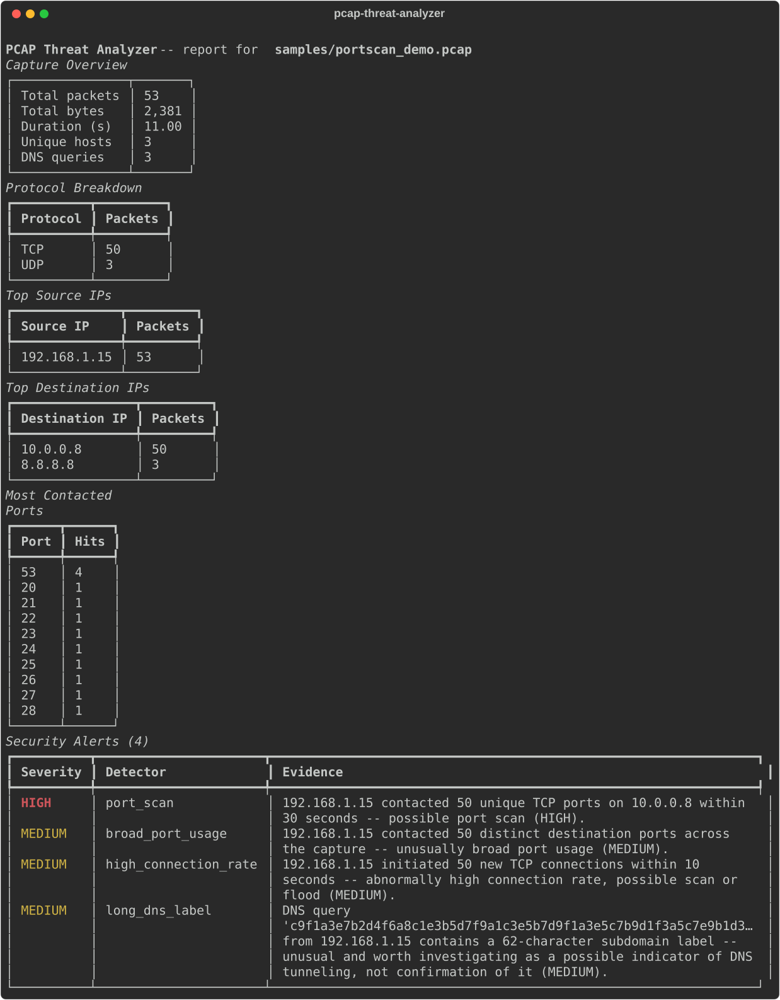

# pcap-threat-analyzer

A command-line tool that reads a `.pcap`/`.pcapng` network capture, summarizes the traffic, and flags patterns that look worth a second look — possible port scans, abnormal connection rates, and DNS activity consistent with beaconing or tunneling.

**This is a network traffic analysis and threat-detection project, not a production IDS.** It runs simple, threshold-based heuristics against packet metadata. It does not do deep packet inspection, decrypt anything, or use machine learning. An alert here means "this pattern matched a rule and is worth investigating" — not "this is confirmed malicious."

## Why I built this

I wanted a project that forced me to actually work with raw packet data instead of just reading about TCP/IP and DNS in a textbook. Building the port-scan and DNS-tunneling detectors meant thinking carefully about what a scan or a tunnel actually looks like at the packet level, what thresholds are reasonable, and — just as important — what normal traffic that *isn't* malicious can look like when it trips the same rule. That last part (false positives) ended up being the most interesting part of the project and the thing I'd talk about first in an interview.

## Features

- Parses `.pcap`/`.pcapng` captures with Scapy (streaming, not loaded fully into memory)
- Extracts per-packet metadata: IPs, ports, protocol (TCP/UDP/other), packet length, TCP flags, DNS queries
- Computes summary statistics: protocol distribution, top source/destination IPs, most-contacted ports, top conversations (flows) by byte volume, capture duration, unique host count
- Five explainable, threshold-based detectors (see [Detection Methodology](#detection-methodology) below), each producing a severity (LOW/MEDIUM/HIGH) and a plain-English evidence string explaining exactly what was observed
- Reports in three formats: colorized terminal output, JSON, and a simple static HTML page
- Small, readable codebase: 7 modules, pure functions for stats/detection, type hints, no framework

## Architecture

```
pcap_analyzer/
├── models.py      # shared dataclasses: PacketRecord, DNSQuery, Flow, StatsSummary, Alert
├── parser.py       # the only module that touches Scapy/file I/O; pcap -> PacketRecord/DNSQuery
├── stats.py        # pure functions: PacketRecord list -> StatsSummary
├── detectors.py     # pure functions: PacketRecord/DNSQuery list -> list[Alert]
├── reporting.py      # StatsSummary + alerts -> terminal / JSON / HTML
└── cli.py             # argparse; wires parser -> stats -> detectors -> reporting
```

The key design choice is that `stats.py` and `detectors.py` never touch Scapy or files — they're pure functions over plain dataclasses. That's what makes the detection logic unit-testable with hand-built Python objects instead of real capture files, and it's also just a clean separation: one module reads pcaps, two modules do analysis, one module formats output, one module wires it together. No plugin system, no config file for thresholds, no database — thresholds are named constants in `detectors.py` with comments explaining each one.

## Installation

Requires Python 3.9+.

```bash
git clone <this-repo>
cd pcap-threat-analyzer
python3 -m venv .venv
source .venv/bin/activate
pip install -e .
```

This installs `scapy` and `rich` (the only two dependencies) and the `pcap_analyzer` package.

## Usage

```bash
python -m pcap_analyzer samples/portscan_demo.pcap
```

Options:

| Flag | Purpose |
|---|---|
| `-o, --output FILE` | Write the full report as JSON to `FILE` |
| `--html FILE` | Write the report as a static HTML page to `FILE` |
| `--verbose` | Also print the top-conversations (flow) table in the terminal output |

Example:

```bash
python -m pcap_analyzer samples/portscan_demo.pcap --output report.json --html report.html --verbose
```

Two small, entirely synthetic sample captures are included in `samples/` (see [Sample data](#sample-data)) so you can try the tool immediately without providing your own capture.

### Screenshot

Terminal output from `python -m pcap_analyzer samples/portscan_demo.pcap`:



## Example output

Running against `samples/portscan_demo.pcap` (a synthetic capture of one host scanning 50 ports on another host):

```
PCAP Threat Analyzer -- report for samples/portscan_demo.pcap
    Capture Overview
┌───────────────┬───────┐
│ Total packets │ 53    │
│ Total bytes   │ 2,381 │
│ Duration (s)  │ 11.00 │
│ Unique hosts  │ 3     │
│ DNS queries   │ 3     │
└───────────────┴───────┘

                              Security Alerts (4)
┏━━━━━━━━━━┳━━━━━━━━━━━━━━━━━━━━━━┳━━━━━━━━━━━━━━━━━━━━━━━━━━━━━━━━━━━━━━━━━━━━┓
┃ Severity ┃ Detector             ┃ Evidence                                   ┃
┡━━━━━━━━━━╇━━━━━━━━━━━━━━━━━━━━━━╇━━━━━━━━━━━━━━━━━━━━━━━━━━━━━━━━━━━━━━━━━━━━┩
│ HIGH     │ port_scan            │ 192.168.1.15 contacted 50 unique TCP ports │
│          │                      │ on 10.0.0.8 within 30 seconds -- possible  │
│          │                      │ port scan (HIGH).                          │
│ MEDIUM   │ broad_port_usage     │ 192.168.1.15 contacted 50 distinct         │
│          │                      │ destination ports across the capture --    │
│          │                      │ unusually broad port usage (MEDIUM).       │
│ MEDIUM   │ high_connection_rate │ 192.168.1.15 initiated 50 new TCP          │
│          │                      │ connections within 10 seconds -- abnormally│
│          │                      │ high connection rate, possible scan or     │
│          │                      │ flood (MEDIUM).                            │
│ MEDIUM   │ long_dns_label       │ DNS query '...62 chars...tunnel.example.   │
│          │                      │ net' from 192.168.1.15 contains a          │
│          │                      │ 62-character subdomain label -- unusual    │
│          │                      │ and worth investigating as a possible      │
│          │                      │ indicator of DNS tunneling, not            │
│          │                      │ confirmation of it (MEDIUM).               │
└──────────┴──────────────────────┴────────────────────────────────────────────┘
```

Running against `samples/normal_traffic.pcap` (a short, ordinary browsing session) produces `Security Alerts (0)` — no false positives from routine HTTPS/SSH traffic and a handful of short DNS lookups.

## Detection methodology

All five detectors are plain threshold rules over packet/DNS metadata — no machine learning, no statistical baselining. Thresholds are hardcoded constants in `pcap_analyzer/detectors.py`.

### 1. Port scan (windowed)
For each (source, destination) pair, counts unique destination TCP ports contacted within any 30-second sliding window. **LOW:** 8–14 ports, **MEDIUM:** 15–29, **HIGH:** 30+.
*False positives:* reverse proxies/load balancers fanning out to many backend ports; NAT gateways where many real hosts appear as one source IP.

### 2. Broad port usage (unwindowed)
For each source host, counts unique destination ports contacted across the *entire* capture, ignoring timing — this catches slow scans that stay under the windowed threshold above. **LOW:** 20–49, **MEDIUM:** 50–99, **HIGH:** 100+.
*False positives:* NAT/proxy devices, P2P clients, a genuinely busy workstation talking to many varied services.

### 3. High connection rate
For each source host, counts pure TCP SYN packets (SYN set, ACK not set) within any 10-second sliding window. **LOW:** 15–29, **MEDIUM:** 30–74, **HIGH:** 75+.
*False positives:* load-testing tools, crawlers, a browser opening many parallel connections for a media-heavy page.

### 4. Repetitive / high-rate DNS
Two sub-checks: (a) number of queries for the *same domain* from the same host across the capture — **LOW:** 20–49, **MEDIUM:** 50–149, **HIGH:** 150+; (b) DNS queries from one host within a 10-second window — **LOW:** 10–19, **MEDIUM:** 20–49, **HIGH:** 50+.
*False positives:* Kubernetes-style health checks, CDN/ad-network lookups, browser prefetching, or a LAN resolver forwarding many real users' queries under one source IP.

### 5. Abnormally long DNS subdomain labels
Measures the longest single label (the text between two dots) in each DNS query name. DNS tunneling tools often encode payload into a subdomain label, so labels approaching the protocol's 63-character maximum are notable. **LOW:** 30–44 characters, **MEDIUM:** 45–62, **HIGH:** exactly 63 (the protocol maximum — this is flagged for being *unusual*, not because it violates the DNS spec; 63-character labels are valid DNS).
*False positives:* CDN/object-storage hostnames, SPF/DKIM-related TXT lookups, some SaaS tenant subdomains — long or high-entropy-looking labels are only an *indicator*, not proof of tunneling.

Alerts from different detectors are reported independently. There's no combined "risk score" across detectors — that would add complexity without adding real signal for a tool this size, and it would make each finding harder to explain on its own.

## Sample data

`samples/` contains two small, entirely synthetic captures generated by `samples/generate_samples.py` using Scapy — no real or downloaded traffic, malicious or otherwise, is used anywhere in this project:

- `normal_traffic.pcap` — a short, unremarkable browsing session (a few HTTPS/SSH connections, three ordinary DNS lookups)
- `portscan_demo.pcap` — one host scanning 50 ports on another host, plus DNS queries with an unusually long subdomain label

Regenerate them with `python samples/generate_samples.py`.

## Testing

```bash
pytest -v
```

22 tests cover: statistics calculations (protocol counts, top-N ordering, byte totals, flow grouping, duration), detector threshold boundaries (including that traffic below a threshold does *not* alert, and that ports spread out beyond the scan window are only caught by the unwindowed detector, not the windowed one), DNS label-length boundaries, and that the parser correctly extracts fields from real pcap bytes. The `stats.py`/`detectors.py` tests use hand-built `PacketRecord`/`DNSQuery` objects (no capture files needed); the `parser.py` tests use two tiny synthetic pcaps built at test time with Scapy.

## Limitations

- Every detector listed above has documented false-positive scenarios; an alert means "matches a heuristic pattern," not "confirmed malicious."
- No encrypted-traffic inspection — this only ever looks at packet metadata (IPs, ports, flags, DNS query names), never payload contents.
- Thresholds are fixed constants tuned for readability and demonstration, not calibrated against real-world traffic baselines; a production deployment would need per-environment tuning.
- No IPv6-specific handling, VLAN/tunneling-aware parsing, or reassembly of fragmented packets.
- Single-pass, single-capture analysis only — no persistence, no cross-capture correlation, no live/streaming capture support.
- Scapy's `PcapReader` is streaming but still notably slower than a lower-level parser like `dpkt` on very large captures; fine for the capture sizes this tool targets, not built for high-throughput production use.

## Future improvements

- A conversation byte-asymmetry heuristic (one host sends far more than it receives to an external IP — a possible exfiltration indicator); the data needed (`Flow.byte_count`) is already tracked, this was left out to keep the initial scope tight.
- Optional GeoIP/ASN lookups on top talkers for extra context in the report.
- A `--pcap-filter` (BPF) option to pre-filter traffic before analysis on large captures.
- CI (GitHub Actions) running the test suite on push.

## Technologies used

- **Python 3** — type-hinted dataclasses, `argparse`, `dataclasses.asdict`
- **Scapy** — pcap/pcapng parsing (chosen over PyShark to avoid a `tshark` system dependency, and over `dpkt` for its higher-level, more readable field access and built-in packet-writing support used to generate safe synthetic test/demo captures)
- **rich** — colorized terminal tables
- **pytest** — unit tests for statistics and detection logic
